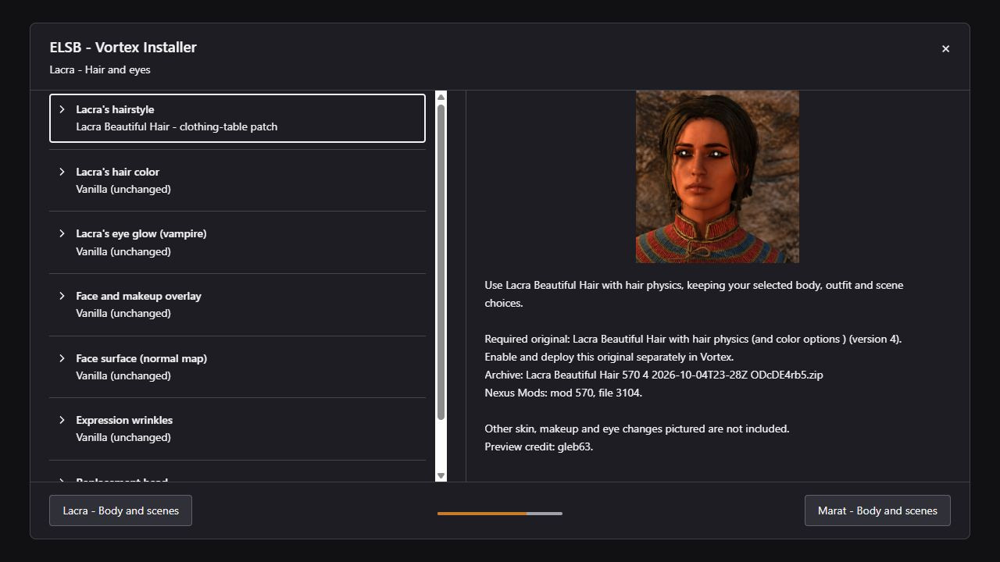
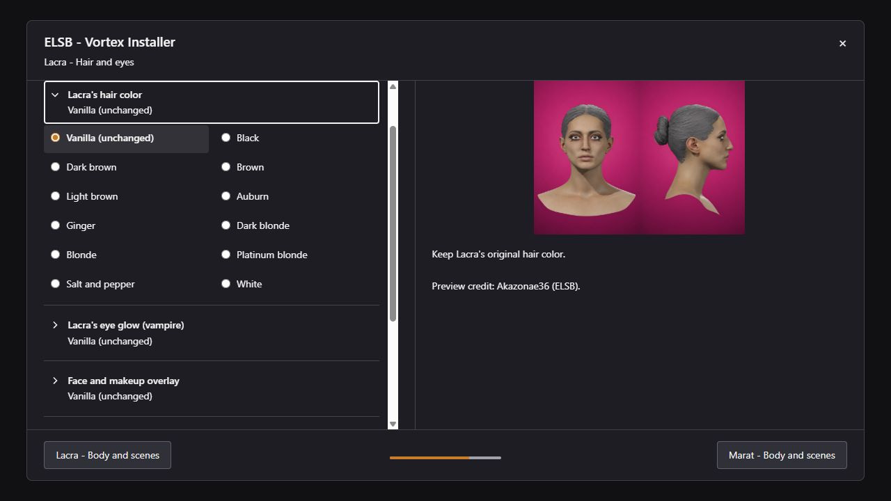

# ELSB · Character Customization

**40 groups · 217 choices · One package for Vortex and manual installation**

Customize Coen, Anca, Lacra and Marat: bodies, hairstyles, colours, faces,
outfits and scene options. Choose through the FOMOD wizard or the original
ELSB toolkit. Both use the same predefined choices and compatibility rules.
Fresh installations start with vanilla selections.



*FOMOD preview with the optional ELSB extension. The standard Vortex installer works without it.*

[Installation](#installation) · [Compatibility choices](#compatibility-choices) · [Preferences and updates](#preferences-and-updates) · [Building from source](#building-from-source)

## Installation

- **Vortex / FOMOD:** Add the complete `ELSB - Vortex Installer.zip` to Vortex and click **Install**. Choose the options you want in the FOMOD, finish the wizard, then enable the mod and deploy. Install the required originals listed beside any compatibility choices. The ELSB extension is optional; see below for its additional interface features.
- **Manual / original toolkit:** Extract the complete ZIP into a folder **outside the game** and run `Start_ELSB.bat`. Select your game folder, choose the character options and click **Apply**. Use the toolkit's import and mod-management features for additional mods. Keep the extracted toolkit to change your choices or use **Remove all** later.

These instructions use the complete installer package. GitHub's **Code → Download ZIP**
contains source and documentation, without the game assets needed to install it.

Windows PowerShell 5.1 and Windows Forms are required for the manual toolkit;
both are included with Windows. Vortex needs its Dawnwalker game extension.
ELSB does not introduce a UE4SS requirement.

### Optional Vortex extension

Install **The Blood of Dawnwalker ELSB Extension.zip** through Vortex's
**Extensions** page, then restart Vortex. It adds expandable groups, previews
of the selected option when you hover over a header, unavailable-option hints,
and restoration of your previous choices. Opening a group closes the other
valid groups and scrolls the opened header into view where space permits.



*An expanded group. Native radio buttons and dependency checks remain in place.*

## Compatibility choices

Install only the originals needed by the choices you select. **Choosing a
compatibility option does not install its required original.** In Vortex,
enable and deploy that original as a separate mod; for a manual installation,
install it separately or import it into the toolkit. The tables below list
the supported file versions, not a claim that every newer download works.

There are **34 compatibility choices covering 21 Nexus mod pages**. These include
fitted outfits, clothing-table merges, texture-priority patches, head routing,
and supported originals that need no additional merge. Follow the requirements
shown beside the specific choice in the installer.

### Coen

| Installer choice | Required Nexus original | Supported version |
| --- | --- | --- |
| Coen's Nude Mod (ELSB fit) | [Coen's Nude Mod](https://www.nexusmods.com/thebloodofdawnwalker/mods/281) | 1.0.8 |
| Evil Twin Retexture v.1.3 Original Skin Tone | [Evil Twin - Coen Retexture](https://www.nexusmods.com/thebloodofdawnwalker/mods/523) | 1.3 |
| Djrd Coen NOFACE Tats | [Tattoos of the Dawnwalker](https://www.nexusmods.com/thebloodofdawnwalker/mods/618) | 1 |
| V1 Djrd Coen Tats | [Tattoos of the Dawnwalker](https://www.nexusmods.com/thebloodofdawnwalker/mods/618) | 1 |
| Body Hair- chest pits and pubes | [Coen's Chest n' Body Hair](https://www.nexusmods.com/thebloodofdawnwalker/mods/621) | 2 |
| Youthful Coen — original | [Youthful Coen](https://www.nexusmods.com/thebloodofdawnwalker/mods/703) | 1 |

### Anca

| Installer choice | Required Nexus original | Supported version |
| --- | --- | --- |
| Wrong Sized Tanktop For Thicc Anca (ELSB fit) | [Wrong Sized Tanktop For Thicc Anca](https://www.nexusmods.com/thebloodofdawnwalker/mods/607) | 1 |
| Revealing Anca (ELSB fit) | [Revealing Anca](https://www.nexusmods.com/thebloodofdawnwalker/mods/531) | 1.2.1 |
| Revealing Thicc Anca by MM (ELSB fit) | [Revealing Thicc Anca by MM](https://www.nexusmods.com/thebloodofdawnwalker/mods/592) | 1 |
| Thicc Anca by MM (ELSB fit) | [Thicc Anca by MM](https://www.nexusmods.com/thebloodofdawnwalker/mods/279) | 1.1 |
| Anca Puffy Hair | [Anca Puffy Hair (With color options)](https://www.nexusmods.com/thebloodofdawnwalker/mods/626) | 1 |
| Anca Young No Eyeliner | [Anca Retexture](https://www.nexusmods.com/thebloodofdawnwalker/mods/404) | 2 |
| Anca Young No Makeup | [Anca Retexture](https://www.nexusmods.com/thebloodofdawnwalker/mods/404) | 2 |
| Anca Young Makeup | [Anca Retexture](https://www.nexusmods.com/thebloodofdawnwalker/mods/404) | 2 |
| Anca Is Really Old | [Anca is Really Old](https://www.nexusmods.com/thebloodofdawnwalker/mods/512) | 1 |
| Rise of Anca Croft — head routing | [Rise of Anca Croft](https://www.nexusmods.com/thebloodofdawnwalker/mods/534) | 1 |

### Lacra

| Installer choice | Required Nexus original | Supported version |
| --- | --- | --- |
| SlimThiccLacrabyMM - table patch | [Thicc Lacra by MM](https://www.nexusmods.com/thebloodofdawnwalker/mods/311) | 1 |
| ThiccLacrabyMM - table patch | [Thicc Lacra by MM](https://www.nexusmods.com/thebloodofdawnwalker/mods/311) | 1 |
| Lacra Gothic Makeup - complete face and body skin | [Goth Lacra](https://www.nexusmods.com/thebloodofdawnwalker/mods/445) | 2 |
| Lacra Gothic Vanilla Makeup - complete face and body skin | [Goth Lacra](https://www.nexusmods.com/thebloodofdawnwalker/mods/445) | 2 |
| Lacra Gothic Dead Skin Vanilla Makeup v2 - complete face and body skin | [Goth Lacra](https://www.nexusmods.com/thebloodofdawnwalker/mods/445) | 2 |
| Lacra Gothic No Makeup - complete face and body skin | [Goth Lacra](https://www.nexusmods.com/thebloodofdawnwalker/mods/445) | 2 |
| Revealing Lacra (ELSB fit) | [Revealing Lacra](https://www.nexusmods.com/thebloodofdawnwalker/mods/501) | 1.2 |
| Lacra Vrakhir Chest Texture - priority patch | [Lacra Chest Texture - Vrakhir Fix](https://www.nexusmods.com/thebloodofdawnwalker/mods/709) | 1.0.0 |
| Lacra Beautiful Hair - clothing-table patch | [Lacra Beautiful Hair with hair physics (and color options )](https://www.nexusmods.com/thebloodofdawnwalker/mods/570) | 4 |
| Makeup v2 (no Eye of Horus) — original | [Young Lacra with makeup options and smooth skin](https://www.nexusmods.com/thebloodofdawnwalker/mods/550) | 2 |
| Lacra Natural Makeup — original | [Young Lacra with makeup options and smooth skin](https://www.nexusmods.com/thebloodofdawnwalker/mods/550) | 1 |
| Lacra Makeup — original | [Young Lacra with makeup options and smooth skin](https://www.nexusmods.com/thebloodofdawnwalker/mods/550) | 2 |
| Lacra Young Makeup — original | [Lacra Retexture](https://www.nexusmods.com/thebloodofdawnwalker/mods/427) | 1 |
| Lacra Young Makeup Alternative — original | [Lacra Retexture](https://www.nexusmods.com/thebloodofdawnwalker/mods/427) | 1 |
| Lacra Smooth Skin | [Young Lacra with makeup options and smooth skin](https://www.nexusmods.com/thebloodofdawnwalker/mods/550) | 1 |
| Lacra LESS Wrinkles — original | [Young Lacra with makeup options and smooth skin](https://www.nexusmods.com/thebloodofdawnwalker/mods/550) | 1 |
| Rise Of Lacra Croft - Human Head Replacement — head routing | [Rise of Lacra Croft](https://www.nexusmods.com/thebloodofdawnwalker/mods/533) | 1 |

### Marat

| Installer choice | Required Nexus original | Supported version |
| --- | --- | --- |
| Coen Nude - Marat fit | [Coen's Nude Mod](https://www.nexusmods.com/thebloodofdawnwalker/mods/281) | 1.0.8 |

### Choosing compatible combinations

**Gothic Lacra belongs in the body group.** Each of its four options includes
the complete face and body skin. Choose the matching Gothic original; separate
Lacra face, chest, surface and wrinkle options cannot accompany it. Gothic is
not available with the included Pussy Walker body.

**Thicc and SlimThicc Lacra are alternative bodies.** Choose one matching
original. Their clothing-table patches can work with Lacra Beautiful Hair;
they do not combine multiple body shapes or provide ELSB outfit refits.

**ELSB + Pussy Walker is an included body choice** for Anca and Lacra. Keep
the standalone [Pussywalker / VaginaMod](https://www.nexusmods.com/thebloodofdawnwalker/mods/370)
disabled when using those adapted bodies.

See [Compatibility.txt](Compatibility.txt) for outfit, texture and head-routing
details. Exact supported archives and file IDs are recorded in
[the dependency manifest](Provenance/required-originals.json). Hair physics,
head alignment, seams, clothing fit and scene transitions still need in-game
acceptance; offline installer checks cannot establish those visual results.

## Preferences and updates

For Vortex, **replace/update the existing ELSB entry and rerun its installer**,
then deploy. Reinstall the same entry when you only want to change choices.
The optional extension restores compatible selections and migrates the earlier
Gothic skin choices into their current body category.

For the manual toolkit, keep your **`ELSB.ini` and `modules/external` folder**
when updating. Earlier names and moved choices are migrated; unrelated settings
and comments are preserved. Settings changes receive a timestamped backup.
Imported mods remain additional manual choices and do not alter the FOMOD.

Apply checks required files before changing the game, preserves unrelated mods,
and restores the previous files if copying or saving preferences fails. If
recovery cannot complete, it retains the backup and reports its location.

### Switching installation methods

Use one method for ELSB at a time. To move **from Vortex to manual**, disable
the ELSB entry and deploy in Vortex before using the toolkit. To move **from
manual to Vortex**, use the toolkit's **Remove all** action for its ELSB files
before installing through Vortex. Imported third-party mods can be managed
separately. Never copy the whole `Payload` folder into the game: it contains
mutually exclusive alternatives.

## Building from source

This repository contains the toolkit, FOMOD configuration, extension, player
documentation, manifests and the installer screenshots shown above. Cooked
game assets, donor assets and the full preview library are supplied locally.

Copy the matching `Payload`, `fomod/images` and `assets` directories from a
verified complete installer package into the checkout. The original ELSB
archive alone does not contain all integrated payloads.
[package-assets.json](Provenance/package-assets.json) lists the required local
files with their sizes and SHA-256 hashes.

Assemble the archive with these entries at its root:

```text
Start_ELSB.bat        ELSB.ps1             SharedInstaller.ps1
fomod/               Payload/             assets/
Readme/              Data/                Provenance/
Audit/               docs/                mod.manifest
README.md            README.txt           Compatibility.txt
Migration.txt        Verification.txt     CREDITS.txt
LICENSE.txt          CHANGELOG.txt        vortex_override_instructions.json
```

Exclude `.git`, `.local`, personal INIs and backups, `modules/external` and
reports. Package the files inside `VortexExtension` separately. Do not add an
enclosing directory around either archive.

`fomod/ModuleConfig.xml` defines predefined choices, dependencies, descriptions
and runtime files. The manual adapter reads those same rules. Both installers
use the same JPEG previews; no WebP or SVG fallback copies are needed.

To inspect a read-only installation plan:

```powershell
powershell -NoProfile -ExecutionPolicy Bypass -File ELSB.ps1 -Plan
```

Add `-SelectionFile choices.json` for a JSON object of stable group and option
IDs from [option-identifiers.json](Provenance/option-identifiers.json).
Existing named toolkit parameters remain supported and override the matching
JSON values. Plan mode does not install files, save preferences or refresh caches.

## Credits and permission

Based on **ELSB 1.1.1 by [Akazonae36](https://www.nexusmods.com/thebloodofdawnwalker/mods/695)**.
The maintainer confirms permission to use, modify and redistribute ELSB.
The original authors retain ownership of their work; this permission does not
grant new rights to other authors' mods or game assets.

The installer previews retain their source credits. The Lacra Beautiful Hair
portrait shown above is credited to **gleb63**; ELSB reference portraits are
credited to **Akazonae36**. See [CREDITS.txt](CREDITS.txt),
[LICENSE.txt](LICENSE.txt) and [Provenance](Provenance) for the full record.
